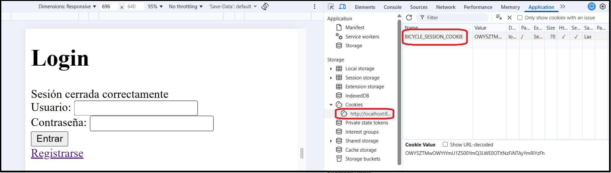
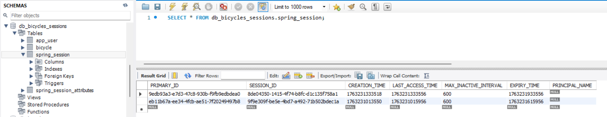

# Simple Sessions & Cookies CRUD (Spring Boot Security + Thymeleaf + MySQL)

It's just that... Just testing Sessions & Cookies using Spring Boot Security with a simple example to make login/register and thymeleaf CRUD protected end-points.

You will find nearly no references to CSRF nor cookies nor sessions handling because Spring Security does it all very transparently.

All the Spring Security Configuration is in SecurityConfig.java file in a nearly magical way:

````
@Configuration
public class SecurityConfig {
	
	@Bean
    public PasswordEncoder passwordEncoder() {
        return new BCryptPasswordEncoder();
    }

	@Bean
    public DaoAuthenticationProvider daoAuthenticationProvider(
            UserDetailsService userDetailsService,
            PasswordEncoder passwordEncoder
    ) {
        DaoAuthenticationProvider provider = new DaoAuthenticationProvider(userDetailsService);
        provider.setPasswordEncoder(passwordEncoder); 
        return provider;
    }

    @Bean
    public SecurityFilterChain securityFilterChain(
            HttpSecurity http,
            DaoAuthenticationProvider daoAuthenticationProvider
    ) throws Exception {

        http
            .authenticationProvider(daoAuthenticationProvider)
            .authorizeHttpRequests(auth -> auth
                .requestMatchers("/login", "/register", "/css/**", "/js/**").permitAll()
                .anyRequest().authenticated()
            )
            .formLogin(form -> form
                .loginPage("/login")
                .defaultSuccessUrl("/", true)
                .permitAll()
            )
            .logout(logout -> logout
                .logoutUrl("/logout")
                .logoutSuccessUrl("/login?logout")
                .invalidateHttpSession(true)
                .clearAuthentication(true)
                .deleteCookies("BICYCLE_SESSION_COOKIE")
                .permitAll()
            );

        return http.build();
    }

}
````

## Getting Started

For the initial steps give a try to my following video for the basics of Spring:
https://www.youtube.com/watch?v=DvzGf0cAlg4

It's a step by step guide to understand how to make a Spring project implementing RESTFul and JPA accessing MySQL.

For this project please read the links at the bottom of this README.md file.

### For the most impatient learners

Clone this project:

````
git clone https://github.com/tcrurav/sessions-cookies-spring-boot-security-using-eclipse.git
````

Open the backend with Eclipse and change the backend/src/main/resources/application.properties according to your database credentials.

Don't forget to create your database in MySQL.

Now you can start your backend project.

Happy coding with Spring Boot Security Sessions & Cookies.

Enjoy!!!

### The most remarkable points in this example

Take a look to the self explanatory resources/application.properties:

````
spring.application.name=bicycles-sessions-and-cookies
spring.datasource.url=jdbc:mysql://localhost/db_bicycles_sessions?useSSL=false&useJDBCCompliantTimezoneShift=true&useLegacyDatetimeCode=false&serverTimezone=UTC&allowPublicKeyRetrieval=true

spring.datasource.username=root
spring.datasource.password=sasa

spring.jpa.properties.hibernate.dialect=org.hibernate.dialect.MySQLDialect
spring.jpa.hibernate.ddl-auto=update

# Default session timeout (in seconds)
server.servlet.session.timeout=600

# Enable JDBC session (if using JDBC)
spring.session.store-type=jdbc
# Creates automaticacly in DB the tables spring_session and spring_session_attributes
spring.session.jdbc.initialize-schema=always

# Enable Redis session (if using Redis)
# spring.session.store-type=redis

# Configure session cookie
server.servlet.session.cookie.name=BICYCLE_SESSION_COOKIE
server.servlet.session.cookie.http-only=true
server.servlet.session.cookie.secure=true
````

Check how the cookie is created in the browser:



Check how the session is stored in the DB:



### Prerequisites

All you need is... some time and...
* Eclipse IDE.
* STS 4, installed through the Eclipse Marketplace.
* MySQL Workbench, to host the database also included in the project.
* Spring boot Security
* Thymeleaf
* More hours than you first could think of...

## Built With

* [Eclipse IDE](https://www.eclipse.org/ide/) - The IDE used
* [Maven](https://maven.apache.org/) - Dependency Management
* [Spring Tools 4](https://spring.io/tools) - The framework used
* [MySQL Workbench](https://www.mysql.com/products/workbench/) - The Database used
* [Spring Session](https://spring.io/projects/spring-session) - Spring Session
* [Thymeleaf](https://www.thymeleaf.org/) - Thymeleaf

## Acknowledgments

* https://docs.spring.io/spring-security/reference/servlet/authentication/session-management.html - Authentication Persistence and Session Management
* https://medium.com/@AlexanderObregon/custom-login-pages-in-spring-boot-without-javascript-frameworks-1ac5dd08bab7 - Custom Login Pages in Spring Boot Without JavaScript Frameworks
* https://www.geeksforgeeks.org/java/spring-boot-thymeleaf-with-example/. Spring Boot - Thymeleaf with Example 
* https://gist.github.com/PurpleBooth/109311bb0361f32d87a2. A very complete template for README.md files.